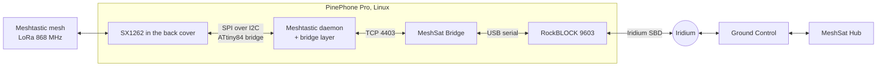

<picture>
  <source media="(prefers-color-scheme: dark)" srcset="docs/images/mark-dark.png">
  
</picture>

### The PinePhone's LoRa back cover as a Meshtastic node, and the phone as a pocket MeshSat gateway.

[MeshSat node](https://github.com/meshsat/meshsat-esp32) ·
[Node firmware](https://github.com/meshsat/meshsat-firmware) ·
[MeshSat Bridge](https://github.com/meshsat/meshsat) ·
[What is proven](#what-is-proven-and-what-is-not) ·
[meshsat.net](https://meshsat.net)

Pine64 sells a back cover for the PinePhone and the PinePhone Pro with a Semtech SX1262 LoRa radio in it. The radio sits behind a small ATtiny84 that turns the phone's I2C pogo pins into the radio's SPI bus. Meshtastic's Linux daemon drives radios over SPI or over the CH341 USB adapter, so out of the box that back cover is not a Meshtastic node.

This repository closes that gap under Linux, in three steps: a bridge layer that lets Meshtastic's daemon talk to the radio through the ATtiny, the packaging that makes the phone a node, and then the MeshSat Bridge on the phone, so a phone in a pocket becomes a gateway between the LoRa mesh and the satellite.

> **Status: pre-release.** This is a prototype under active development, not a finished product. The bridge and a LongFast receive are proven on one phone; nothing else has run on hardware yet. It has never been deployed to a real user and has never been used in an actual emergency. See [What is proven, and what is not](#what-is-proven-and-what-is-not) before you rely on it for anything.

## How it fits together

## What is here

- `tools/jf002-demo/`: the first bench step. A patch that turns JF002's PineDio demo into a listener on Meshtastic's EU_868 LongFast settings, and the script that builds it on the phone. Built and run on the phone on 27 September 2026; it received the T-Deck.
- [`docs/BACKPLATE.md`](docs/BACKPLATE.md): the bridge protocol as verified on the phone (bus and address, how an SPI transfer is carried, the ring-buffer sync, what the bridge cannot do), written from the bench of 27 September 2026.
- The bridge layer for Meshtastic's Linux daemon, built with the [MeshSat fork of the Meshtastic firmware](https://github.com/meshsat/meshsat-firmware).
- The daemon configuration, a service unit and an install page for the phone.
- The pocket Bridge: the MeshSat Bridge on the phone with a TCP link to the daemon.

## The bridge, in short

The ATtiny84 answers at I2C address 0x28. An SPI write to the radio is one I2C write: the byte 0x01 followed by the bytes to clock out. The bytes the radio clocked back during that write are read afterwards, one byte per I2C read. The radio's BUSY and DIO1 lines are not brought out as GPIO, so the driver asks the radio itself, through the bridge, whether it is busy and which interrupts are set. This makes the link slower than a wired SPI bus; the bench measures by how much. The protocol comes from JF002's driver for the back cover, which this project uses for the first bring-up.

## What is proven, and what is not

|                                                            | State                                       |
| ---------------------------------------------------------- | ------------------------------------------- |
| The bridge answers on the PinePhone Pro                    | **Yes**, 0x28 on i2c-5, Mobian 6.12, 27 Sep 2026 |
| A LongFast packet received through the existing driver     | **Yes**, a T-Deck text on 27 Sep 2026, see [docs/BACKPLATE.md](docs/BACKPLATE.md) |
| Meshtastic's daemon running the radio through the bridge   | **Not built yet**                           |
| Texts exchanged with another Meshtastic node               | **Not built yet**                           |
| The MeshSat Bridge on the phone, a text out to the satellite | **Not built yet**                         |
| Deployment to a real end user                              | **Never**                                   |
| Use in an actual emergency                                 | **Never**                                   |

## Related projects

- **[MeshSat node](https://github.com/meshsat/meshsat-esp32)** and **[meshsat-firmware](https://github.com/meshsat/meshsat-firmware)**, the ESP32 node this phone will talk to over LoRa
- **[MeshSat Bridge](https://github.com/meshsat/meshsat)**, the gateway software that will run on the phone
- **[meshsat-sx1262-driver-android](https://github.com/meshsat/meshsat-sx1262-driver-android)**, the same back cover under Android, from the MeshSat Android app
- **Pine64's PineDio**: the [back cover and USB adapter](https://wiki.pine64.org/wiki/Pinedio), and [JF002's driver](https://codeberg.org/JF002/pinedio-lora-driver)

## Licence

GPL-3.0, like the rest of MeshSat. Meshtastic is a registered trademark of Meshtastic LLC; this project is not affiliated with it.
