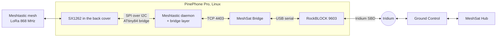

<div align="center">

<picture>
  <source media="(prefers-color-scheme: dark)" srcset="docs/images/mark-dark.png">
  
</picture>

### The PinePhone's LoRa back cover as a Meshtastic node, and the phone as a pocket MeshSat gateway.

[](LICENSE)


[MeshSat node](https://github.com/meshsat/meshsat-esp32) ·
[Node firmware](https://github.com/meshsat/meshsat-firmware) ·
[MeshSat Bridge](https://github.com/meshsat/meshsat) ·
[What is proven](#what-is-proven-and-what-is-not) ·
[meshsat.net](https://meshsat.net)

</div>

Pine64 sells a back cover for the PinePhone and the PinePhone Pro with a Semtech SX1262 LoRa radio in it. The radio sits behind a small ATtiny84 that turns the phone's I2C pogo pins into the radio's SPI bus. Meshtastic's Linux daemon drives radios over SPI or over the CH341 USB adapter, so out of the box that back cover is not a Meshtastic node.

This repository closes that gap under Linux, in three steps: a bridge layer that lets Meshtastic's daemon talk to the radio through the ATtiny, the packaging that makes the phone a node, and then the MeshSat Bridge on the phone, so a phone in a pocket becomes a gateway between the LoRa mesh and the satellite.

> **Status: pre-release.** This is a prototype under active development, not a finished product. The bridge, the transport and receive are proven on one phone on one bench, and Meshtastic's daemon has run on it and received. **Transmit is not solved:** short frames arrive, the frames a node really sends arrive damaged, and no text sent by the daemon has been read on another node. One fault left the radio deaf to every command until the cover was taken off and put back. It has never been deployed to a real user and has never been used in an actual emergency. See [What is proven, and what is not](#what-is-proven-and-what-is-not) before you rely on it for anything.

## How it fits together



## What is here

- [`docs/data/`](docs/data/): every frame the phone sent on the bench that a record survives of, one line each, with the receiver's verdict.
- [`docs/BACKPLATE.md`](docs/BACKPLATE.md): the bridge as verified on the phone. Bus and address, how an SPI transfer is carried, the ring-buffer sync, what the bridge cannot do, and how it behaves in time, measured on the bench of 27 September 2026.
- `src/`: **the bridge as a transport for an SX1262 driver.** `PineDioBridge` carries SPI frames over the ATtiny and stands in for the BUSY, DIO1 and reset lines the back cover does not have. `PineDioBridgeHal` adapts it to [RadioLib](https://github.com/jgromes/RadioLib). `library.json` makes it a PlatformIO library.
- `test/`: a simulated back cover, the ATtiny as its firmware behaves and enough of an SX1262 to run RadioLib's unmodified driver against, on simulated time. 29 transport cases, 14 RadioLib cases and 7 for the bench tools. The simulator is a model of what was measured on one unit: it proves the transport's logic and nothing about the air.
- `tools/bridge-selftest`: checks a real back cover without a radio library. Transmits nothing.
- `tools/lora-listen`: RadioLib's driver over the bridge, receive only, tuned to Meshtastic's EU_868 LongFast by default.
- `tools/lora-ping`: sends Meshtastic-shaped frames of a chosen length, power, coding rate and preamble. `--from` chooses what the radio does while the frame is loaded, which decides whether its crystal is running when the transmission begins, and the mode the radio reports is read back as proof. Every frame is written down before it is sent, in a file that keeps the airtime of the hour and refuses the frame the hour has no room for.
- `tools/bench/verdict.py`: gives every frame sent one verdict from a receiving node's firmware log. A frame counts as received only on a complete line that says so, and a capture that was not running counts neither for the radio nor against it. `capture.py` keeps the receiver's log with the time each line was read and shows that it was running while the receiver was silent; `daemon_airtime.py` puts the daemon's transmissions into the same airtime file. Their tests run without hardware: `python3 -m unittest` in `tools/bench`.
- `tools/node-setup/`: gives a new node its region, name, role and channels over the daemon's TCP port, and reads them back.
- `tools/jf002-demo/`: the first bench step. A patch that turns JF002's PineDio demo into a listener on the same settings, and the script that builds it on the phone. It received the T-Deck on 27 September 2026.
- `packaging/meshtasticd/`: the daemon's configuration for the phone. Its transmit settings are experimental and known not to carry a node's longer frames.
- The daemon itself is built from the [MeshSat fork of the Meshtastic firmware](https://github.com/meshsat/meshsat-firmware), environment `meshsat-pinephone-pro`, which takes this library and adds `spidev: pinedio-i2c` as a radio bus. `meshsat-pinephone-pro-rxonly` is the same with its transmitter switched off at every boot.
- Still to come: a service unit and an install page, and the pocket Bridge, the MeshSat Bridge on the phone with a TCP link to the daemon.

## Build and test

```
cmake -B build && cmake --build build -j4
ctest --test-dir build                        # the simulated back cover, no hardware
build/bridge-selftest /dev/i2c-5              # a real back cover
build/lora-listen /dev/i2c-5 --seconds 600
```

RadioLib is fetched at version 7.7.1, or taken from `-DRADIOLIB_DIR=`. On the phone: `apt install i2c-tools git cmake g++ make`, the user in group `i2c`.

## The bridge, in short

The ATtiny84 answers at I2C address 0x28. An SPI write to the radio is one I2C write: the byte 0x01 followed by the bytes to clock out. The bytes the radio clocked back during that write are read afterwards, one byte per I2C read. The radio's BUSY and DIO1 lines are not brought out as GPIO, so the driver asks the radio itself, through the bridge, which interrupts are set, and waits out the time the radio would have been busy. The link is slow: about 4 ms for every byte, because the bridge's firmware prints each one on a debug port. Asking the radio whether anything happened takes 6 ms, fetching a received frame of 50 bytes 290 ms. The protocol comes from JF002's driver for the back cover, which this project used for the first bring-up.

## What is proven, and what is not

|                                                              | State                                              |
| ------------------------------------------------------------ | -------------------------------------------------- |
| The bridge answers on the PinePhone Pro                      | **Yes**, 0x28 on i2c-5, Mobian 6.12, 27 Sep 2026   |
| A LongFast packet received through the existing driver       | **Yes**, a T-Deck text on 27 Sep 2026              |
| The transport against a simulated back cover                 | **Yes**, 38 cases, also under ASan, UBSan and TSan |
| The transport against the real back cover, without the air   | **Yes**, `bridge-selftest` on 27 Sep 2026          |
| RadioLib's driver started on the real radio through it       | **Yes**, `lora-listen` on 27 Sep 2026              |
| A packet received by RadioLib's driver through it            | **Yes**, the T-Deck and the T-Beam, 50 and 170 bytes, 27 Sep 2026 |
| Meshtastic's daemon running the radio through the bridge     | **Yes**, 27 Sep 2026, with the usual preamble      |
| A text received by the daemon, and a traceroute there and back | **Yes**, with a T-Deck Pro, 27 Sep 2026          |
| A text sent by the daemon and read on another node           | **No.** Six sendings of 90 and 154 bytes and a node announcement of 176 bytes were all refused with a checksum error, 27 Sep 2026 |
| Short frames sent by the back cover, accepted by another node | **Yes**, 32 bytes at 14 and 22 dBm, 6 of 6, and 76 bytes at 10 dBm, 2 of 2, at 2 m, 27 Sep 2026; checksum only, the content was not compared |
| Frames of 126 bytes and more from a rested radio             | **No** at 5 dBm and above: 0 of 22, with preambles of 160 to 320 symbols. At 0 dBm and below with a long preamble, 126 bytes were accepted 5 of 5, longer ones 2 of 12 |
| Range, and packet loss over time                             | **Not measured**                                   |
| Recovery of a radio that stopped answering, without hands    | **No**, a reboot does not reset it, and the cause is not known |
| Use without a person nearby                                  | **Not possible** as long as only a hand can reset the radio |
| The MeshSat Bridge on the phone, a text out to the satellite | **Not built yet**                                  |
| Deployment to a real end user                                | **Never**                                          |
| Use in an actual emergency                                   | **Never**                                          |

## Related projects

- **[MeshSat node](https://github.com/meshsat/meshsat-esp32)** and **[meshsat-firmware](https://github.com/meshsat/meshsat-firmware)**, the ESP32 node this phone will talk to over LoRa
- **[MeshSat Bridge](https://github.com/meshsat/meshsat)**, the gateway software that will run on the phone
- **[meshsat-sx1262-driver-android](https://github.com/meshsat/meshsat-sx1262-driver-android)**, the same back cover under Android, from the MeshSat Android app
- **Pine64's PineDio**: the [back cover and USB adapter](https://wiki.pine64.org/wiki/Pinedio), and [JF002's driver](https://codeberg.org/JF002/pinedio-lora-driver)

## Licence

GPL-3.0, like the rest of MeshSat. Meshtastic is a registered trademark of Meshtastic LLC; this project is not affiliated with it.
